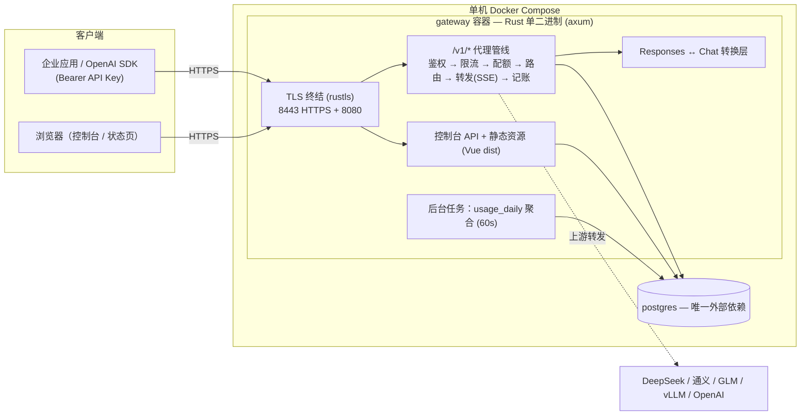

# LLM Gateway

企业内网 LLM API 网关：对外暴露 **OpenAI 兼容接口**（Chat Completions / Responses / Embeddings），统一鉴权、限流、配额、路由与用量计费，并提供带管理后台的 Web 控制台和公开服务状态页。

单二进制部署（Rust + axum），唯一外部依赖 PostgreSQL。定位为 <200 用户、低并发的内部部署，架构预留多实例扩展路径。

## 功能特性

**网关（OpenAI 兼容代理）**

- `POST /v1/chat/completions`、`/v1/completions`、`/v1/embeddings`、`GET /v1/models`
- `POST /v1/responses`（OpenAI Responses API）：上游原生支持时透传（`api_type=openai-responses`），否则自动做 Responses ↔ Chat 转换（非流式 + 流式状态机），新旧 OpenAI SDK 均可直连
- API Key 鉴权：Key 仅存 SHA-256 哈希 + 12 位前缀定位，明文只在创建时展示一次；可配置为不鉴权（仅本地开发）
- 三层速率限制（API Key → 用户 → 全局，令牌桶，BOOTTIME 回填时钟），命中返回 429 + `Retry-After` + OpenAI 标准错误体；长时间空闲后恢复的首请求空闲豁免，避免 agent 暂停等待用户确认后恢复即 429（见「限流与长时间空闲恢复」）
- 月度配额：按用户限制 Token/成本上限，记账事务内原子扣减，超限 429
- 模型路由：通配 pattern + priority 匹配，支持 `fallback_ids` 降级链（非流式对 429/5xx/超时自动重试；流式不重试避免重复生成）
- Token 计量：优先解析上游 `usage`（流式自动注入 `include_usage`），usage 双形态（`prompt_tokens` / `input_tokens`）归一化
- 用量计费：按模型单价 × Token 计算成本，请求日志与配额计数**同事务原子写入**，无对账需求
- 上游 4xx/5xx 透明透传不吞错误；全链路 `request_id`（uuid v4）+ `X-Request-Id` 透传

**控制台（Vue 3 + Element Plus）**

- LDAP 登录（AD / OpenLDAP 配置驱动，memberOf 组映射管理员）+ 本地账号；内置 break-glass 本地管理员
- JWT 会话（access 15 分钟 / refresh 30 天，可配置），支持强制下线（token 版本吊销）
- 仪表盘、API Key 自助管理、用量统计（时间段 × 模型维度 + 图表）、实时监控（5 分钟粒度轮询）
- 管理后台：用户生命周期（重置密码 / 禁用 / 强制下线）、供应商配置（Key AES-256-GCM 加密落库，永不回显）、路由规则、模型库、限流规则、月度配额、模型价格、LDAP 设置（含连通性测试）
- 管理操作全部写入审计日志，可追溯

**公开状态页（仿 status.openai.com）**

- 无需登录的 `/status` 页面 + `GET /api/status`
- 组件实时状态（网关 / PostgreSQL / 各上游供应商）+ 近 30 天按日可用率色块 + 事故历史（自动检测 + 相邻小时合并 + 严重度分级）
- 完全基于真实调用记录被动监测，不发合成探测请求，零额外成本

## 架构总览



关键设计决策：

1. **模块化单体**：代理热路径、控制台、后台任务同进程；无 Nginx（TLS 由 rustls 终结，静态资源由 tower-http 托管），无 Redis。
2. **记账与热路径零组件解耦**：请求完成后同步单事务直写（日志 + 配额计数原子提交），延迟代价 ~1–2ms，相对 LLM 秒级响应不可见。
3. **内存态仅存在于单实例**：限流令牌桶、配额计数缓存、路由表在进程内，启动 / 30s 周期从 PG 热加载。多实例需换 Redis 实现（接口已封装）。

## 技术栈

| 层 | 选型 |
|---|---|
| 网关核心 | Rust (edition 2024) + axum 0.8 + tokio |
| TLS | tokio-rustls + hyper-util（ALPN: h2 + http/1.1） |
| HTTP 转发 | reqwest（rustls, stream，SSE 逐块透传） |
| 数据库 | sqlx + PostgreSQL 16（编译期 SQL 校验，迁移内嵌于二进制） |
| 加密 | AES-256-GCM（供应商 Key）+ SHA-256（API Key） |
| 认证 | LDAP (ldap3) + JWT (jsonwebtoken) + argon2（本地密码） |
| 前端 | Vue 3 + TypeScript + Element Plus + ECharts + Pinia |
| 部署 | Docker Compose（gateway + postgres，可选 OpenLDAP profile） |

## 快速开始（Docker Compose）

前置：Docker + Docker Compose。

```bash
# 1. 配置环境变量
cp .env.example .env
#    必改：GATEWAY_MASTER_KEY（openssl rand -hex 32 生成）、SEED_ADMIN_PASSWORD
#    （如启用 LDAP 登录再配置 LDAP_*）

# 2. 生成自签证书（公网部署请改用公司 CA / ACME 证书，替换 certs/ 下文件）
bash scripts/gen-cert.sh

# 3. 全自动构建（多阶段 Dockerfile：前端 + Rust + 运行镜像一步到位）
docker compose up -d --build

#    或本机快速构建（利用本地 cargo 缓存，秒级打镜像）：
#    npm run build --prefix web && bash scripts/deploy-local-binary.sh

# 4. 验证
curl -sk https://127.0.0.1:8443/healthz
```

- 控制台：https://127.0.0.1:8443 （首次启动自动创建 `SEED_ADMIN_USERNAME` 管理员）
- 状态页：https://127.0.0.1:8443/status（公开，无需登录）
- 8080 端口行为由 `GATEWAY_HTTP_REDIRECT` 决定：`true` = 仅 301 重定向到 HTTPS（默认）；`false` = 直接明文服务（测试/内网用，compose 默认关闭重定向）

### 首次调用示例

```bash
# 控制台 → API Keys 创建 Key（明文仅显示一次）
curl -sk https://127.0.0.1:8443/v1/chat/completions \
  -H "Authorization: Bearer sk-xxx" \
  -H "Content-Type: application/json" \
  -d '{"model":"deepseek-chat","messages":[{"role":"user","content":"你好"}]}'
```

未配置供应商时，网关在 `providers` 表为空的首启会自动按 `SEED_PROVIDER_*` 环境变量种入默认上游。

## 配置说明（环境变量）

| 变量 | 默认 | 说明 |
|---|---|---|
| `GATEWAY_DATABASE_URL` | — | PostgreSQL 连接串（compose 内为 `@postgres:5432`） |
| `GATEWAY_HTTPS_ADDR` / `GATEWAY_HTTP_ADDR` | `0.0.0.0:443` / `0.0.0.0:80` | 监听地址 |
| `GATEWAY_TLS_CERT` / `GATEWAY_TLS_KEY` | `certs/cert.pem` / `key.pem` | TLS 证书（P-256 自签或 CA 签发） |
| `GATEWAY_MASTER_KEY` | — | AES-256-GCM 主密钥（64 hex），**必须更换**；缺失时 JWT 密钥由它派生 |
| `GATEWAY_AUTH_MODE` | `api_key` | `none` = 跳过 API Key 鉴权（仅本地开发） |
| `GATEWAY_RELOAD_INTERVAL` | `30` | 路由/限流/供应商配置热加载周期（秒） |
| `GATEWAY_RATE_IDLE_EXEMPT_SECS` | `60` | 限流恢复豁免阈值：主体静默 ≥ 该秒数后恢复的首请求若被限流则豁免放行（每空闲间隙至多一次）；`0` = 关闭。见「限流与长时间空闲恢复」 |
| `GATEWAY_WEB_DIR` | `web/dist` | 控制台静态资源目录；目录不存在时 `/` 返回服务信息 JSON |
| `GATEWAY_JWT_SECRET` / `GATEWAY_ACCESS_TOKEN_TTL` / `GATEWAY_REFRESH_TOKEN_TTL` | 派生 / `900` / `2592000` | 控制台会话 |
| `LDAP_URL` / `LDAP_STARTTLS` / `LDAP_BIND_DN` / `LDAP_BIND_PASSWORD` / `LDAP_BASE_DN` / `LDAP_USER_FILTER` / `LDAP_ADMIN_GROUPS` | — | LDAP 登录（AD 默认 `sAMAccountName`，OpenLDAP 用 `uid`；不配置则仅本地账号） |
| `SEED_ADMIN_USERNAME` / `SEED_ADMIN_PASSWORD` | `admin` / `change-me-now` | break-glass 本地管理员（无本地管理员时首次启动创建） |
| `SEED_PROVIDER_NAME` / `SEED_PROVIDER_BASE_URL` / `SEED_PROVIDER_API_KEY` / `SEED_MODEL_PATTERN` | 空 | 首次启动种子上游（`providers` 表为空时生效） |

## API 概览

| 路径 | 鉴权 | 说明 |
|---|---|---|
| `GET /healthz` | 无 | 存活探针 |
| `GET /` | 无 | 服务信息 JSON（配置了前端目录时为控制台页面） |
| `POST /v1/chat/completions`、`/v1/completions`、`/v1/embeddings`、`/v1/responses`、`GET /v1/models` | Bearer API Key | OpenAI 兼容调用面 |
| `GET /api/status` | 无 | 公开状态：组件状态 + 30 天可用率 + 事故 |
| `POST /api/auth/login`、`/refresh`、`/logout` | — | 控制台会话（LDAP / 本地账号） |
| `GET /api/me`、`/api/keys`、`/api/usage`、`/api/usage/trend` | JWT | 个人资料、Key 管理、用量查询 |
| `GET/POST /api/admin/users`、`/providers`、`/routes`、`/rate-limits`、`/quotas`、`/prices`、`/models`、`/settings/ldap`、`/audit`、`/usage/realtime` 等 | JWT + 管理员 | 管理后台 CRUD 与运维接口 |

错误约定：API 错误统一返回 `{"error": {"message", "code", "type"}}` 形状；限流 429 带 `Retry-After`；上游错误透明透传。

## 状态页监测语义

`/status` 页面的所有结论都来自 `usage_logs` 真实调用记录（`status >= 400` 视为失败；鉴权/限流 4xx 在进入代理管线前返回，不写入日志，不污染错误率）：

- **组件实时状态**：按窗口错误率判定——优先近 10 分钟，样本不足（<5 次）依次回退 60 分钟、24 小时；≥50% 不可用（红）、≥10% 性能下降（黄）、否则正常（绿）、24 小时无流量显示未知（灰）
- **30 天可用率**：按 UTC 日聚合成功率，绿/黄/红/深红分级
- **事故**：单小时桶调用 ≥5 且错误率 ≥50% 判定事故小时，相邻小时自动合并为一次，峰值 ≥80% 标为重大，进行中（<1 小时）标注「进行中」
- 系统组件（网关/PostgreSQL）只有实时状态，无历史可用率（被动监测无数据源，如实显示）


## 限流与长时间空闲恢复

### 策略与空闲期配额语义

三层规则（API Key → 用户 → 全局）均为**进程内令牌桶**：桶容量 = `burst`，回填速率 = `rpm/60` 每秒，请求消耗 1 个令牌，不足即 429 + `Retry-After`（距下一个令牌的秒数，上限 24h）。空闲期间**没有任何扣减**——桶按真实流逝时间惰性回填直至 `burst`（`rpm=1, burst=5` 时空闲 5 分钟即回满）。回填时钟在 Linux 上取 `CLOCK_BOOTTIME`（含系统挂起/睡眠时间；`std::time::Instant` 的 `CLOCK_MONOTONIC` 在机器睡眠时不前进，会导致睡眠等待后的令牌少回填）。

### 长时间等待后恢复触发 429 的根因

agent 暂停等待用户确认期间，**共享作用域桶（尤其 global）会被其他会话/其他用户的流量耗尽**。恢复执行的首请求撞上已耗尽的桶 → 429，`Retry-After = 60/rpm` 秒——低 rpm 配置下即“额外冷却分钟级才能用”。该主体的 user/key 桶哪怕已回满也无济于事，因为命中即拒作用于任一层。叠加因素：恢复瞬间客户端并发齐发（主循环 + 并行子代理），burst 再大也可能被瞬间打穿。

### 修复：空闲恢复豁免（resume exemption）

网关无法感知客户端“暂停/恢复”，因此不做计时暂停（服务端不可实现），改为**按可观测的空闲间隙豁免**：

- 每个主体（`u:{user_id}|k:{key_id}`）记录最近一次活动时间，**任意结局的请求（含被拒）都刷新活动时间**；
- 主体静默 ≥ `GATEWAY_RATE_IDLE_EXEMPT_SECS`（默认 60s）后的**首个请求**若被某层规则拒绝，则豁免放行（不扣空桶、不重置任何桶），并记录 `rate limit resume exemption granted` 日志；
- 每个空闲间隙至多豁免一次；主体首次出现（冷启动）视同长空闲后恢复；
- 高频请求永远攒不出空闲间隙，豁免零影响——防压制能力不变。

**防滥用边界**：豁免最坏放大 = 每主体每阈值窗口 1 个请求（仅当拒绝桶已耗尽时发生）；N 个主体交替静默可造成聚合速率超出 global 上限 `N/阈值`，阈值即调节旋钮；登录限流（`login:*` 桶）不参与豁免。

**运维要点**：global 层 rpm 决定 429 后每令牌冷却时间（`60/rpm` 秒），面向并行 agent 客户端建议 ≥ 数百 rpm + 百级 burst；本仓演示数据原为 `rpm=1, burst=5`（每分钟 1 请求），已调整为 `600/100`。豁免只解决“恢复首请求”，恢复后的持续速率仍受规则约束——客户端应遵循 `Retry-After` 重试（OpenAI 兼容客户端均支持）。

### 已知边界

- 单实例语义：豁免状态与令牌桶均在进程内，重启清零（重启后冷启动豁免兜底）；多实例需 Redis 实现。
- 上游 429 与网关自身 429 相互独立：非流式按降级链重试上游 429/5xx；流式不重试（防重复生成），上游 429 原样透传。
- 流式请求在网关自身限流处被拒时同样返回 429 JSON（未建立上游连接，无计费）。

## 数据模型

核心表（迁移见 `migrations/`，随二进制内嵌自动执行）：

| 表 | 用途 |
|---|---|
| `users` / `api_keys` | 本地 + LDAP 镜像账号；API Key（哈希 + 前缀） |
| `providers` / `model_routes` | 上游供应商（Key 加密存储、`api_type` 区分 Responses 原生/转换）；模型路由 + 降级链 |
| `usage_logs` | 用量明细（`request_id` 唯一防重复记账，按用户/时间索引） |
| `user_monthly_usage` / `usage_daily` | 配额计数（记账事务内 UPSERT）；仪表盘聚合（60s 后台任务） |
| `model_prices` / `rate_limit_rules` / `user_quotas` | 单价、限流规则、用户配额 |
| `refresh_tokens` / `audit_logs` / `aggregation_state` | 会话、审计、聚合水位 |

## 本地开发

```bash
# 后端：需要本地 PostgreSQL（或 docker compose up -d postgres）
cargo run                      # 读取 .env，监听 8443/8080
cargo test                     # 单元测试 26 项（Responses 转换 + SSE 解析回归）

# 前端（Vite dev server，/api 与 /v1 代理到 8443）
cd web && npm install && npm run dev
npm run build                  # vue-tsc 类型检查 + 产物构建（提交前必跑）

# 无真实上游时本地模拟
python3 scripts/mock_upstream.py   # http://127.0.0.1:9001/v1，支持 chat/responses
```

其他脚本：`scripts/gen-cert.sh`（自签证书）、`scripts/deploy-local-binary.sh`（本机编译 release 后打运行时镜像）、`scripts/seed-ldap.sh`（演示用 OpenLDAP 种子数据，配合 `--profile ldap`）。

## 已知限制

1. **单实例语义**：限流令牌桶、配额计数缓存、路由表均在进程内，多实例部署需换 Redis 实现（已封装，接口不变）。
2. **记账同步写入**：PostgreSQL 不可用时请求失败（内部系统可接受），无丢失窗口。
3. **`usage_logs` 不分表**：规模增长后需按月 RANGE 分区（`request_id` 唯一约束需配合调整）。
4. **流式依赖上游 `include_usage`**：不支持的供应商暂走零值兜底（启发式估算未实现）。
5. **流式断连记账**：客户端中途断开时流式记账可能丢失（预存架构问题，非 Responses 转换引入）。
6. **Responses 升级路径未做**：Chat 客户端 → Responses 原生上游的转换未实现（目标上游均兼容 Chat，无收益）。

## 相关文档

- `docs/plans/2026-08-08-llm-gateway-design.md` — 定稿设计（数据模型、安全设计、权衡清单）
- `docs/plans/2026-08-10-responses-api-port.md` — Responses API 兼容层移植设计（转换规则、SSE 状态机、回归步骤）
