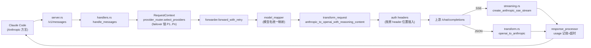

# cc-switch API 协议转换层深度分析

> 分析对象：`~/AI/code/cc-switch`（v3.20.0，commit 状态为当前工作区）
> 分析范围：`src-tauri/src/proxy/` 协议转换层（约 69,400 行 Rust）
> 本文档所有结论均附文件路径 + 行号 + 代码摘录，可直接验证。

---

## 0. 项目定位与方向说明

cc-switch 是 Tauri 桌面应用：React 前端 + Rust 后端。协议转换层位于 **`src-tauri/src/proxy/`**，是一个本地 HTTP 反向代理，夹在"CLI 客户端方言"与"上游供应商方言"之间。

**方向澄清**：代码里的实际方向由**客户端决定请求方向、上游决定响应方向**。cc-switch 实现的是四条双向管线：

| 场景 | 客户端 | 上游 | 请求转换 | 响应转换 | 核心文件 |
|---|---|---|---|---|---|
| ① Responses↔Chat | Codex CLI（说 Responses） | OpenAI 兼容（说 Chat） | Responses→Chat | **Chat→Responses** | `transform_codex_chat.rs` + `streaming_codex_chat.rs` |
| ② Chat↔Anthropic | Claude Code（说 Anthropic） | OpenAI 兼容（说 Chat） | Anthropic→Chat | **Chat→Anthropic** | `transform.rs` + `streaming.rs` |
| ③ Responses↔Anthropic | Codex CLI | Anthropic 网关 | Responses→Anthropic | Anthropic→Responses | `transform_codex_anthropic.rs` + `streaming_codex_anthropic.rs` |
| ④ Anthropic↔Responses | Claude Code | Responses 上游 | Anthropic→Responses | Responses→Anthropic | `transform_responses.rs` + `streaming_responses.rs` |

场景③承载了"max_tokens 补全、user/assistant 交替适配"等**向 Anthropic 格式收敛**的全部逻辑。

场景①②的文件头注释明确声明了方向，例如 `transform_codex_chat.rs:1-5`：

```rust
//! Codex Responses ↔ OpenAI Chat Completions conversion.
//! This module is used when the Codex client talks to CC Switch through the
//! Responses API, while the selected upstream provider only exposes an
//! OpenAI-compatible Chat Completions endpoint.
```

`transform_codex_anthropic.rs:9-11` 明确写出与 `transform_responses.rs` 互为镜像关系：

```rust
//! The direction is exactly the mirror of `transform_responses.rs`:
//! - `transform_responses.rs`: Anthropic request → Responses request, Responses response → Anthropic response
//! - this module:               Responses request → Anthropic request, Anthropic response → Responses response
```

---

## 1. 管线①：Responses ↔ Chat Completions

### 1.1 请求方向：Responses → Chat

入口 `responses_to_chat_completions_with_reasoning`（`transform_codex_chat.rs:264`）。

#### system / instructions

- `instructions` 字段（string 或 content parts 数组，`instruction_text` :582 支持 `[{text:...}]` 拼接）变成首条 `system` message（:276-284）；
- `collapse_system_messages_to_head`（:554-580）把历史上散落的所有 system 消息收拢到头部，用 `\n\n` join——保证前缀稳定以命中上游缓存。

#### input items → messages

核心在 `append_responses_item_as_chat_message`（:667-878），按 item 类型分发：

| Responses item | Chat 产物 | 位置 |
|---|---|---|
| `function_call` | 暂存 `pending_tool_calls`，遇下一条非工具消息时由 `flush_pending_tool_calls`（:880-903）合成一条 `{"role":"assistant","content":null,"tool_calls":[...]}` | :678-684 |
| `custom_tool_call` | 同上；参数包装为 `{"input": <原字符串>}`（`CUSTOM_TOOL_INPUT_FIELD`） | :1353-1370 |
| `tool_search_call` | 同上；统一代理名 `"tool_search"` | :1372-1391 |
| `function_call_output` | 立即 flush 前面的工具调用批次，产出 `{"role":"tool","tool_call_id":call_id,"content":<output 字符串化>}`；output 若是可解析 JSON 会先 canonical 化（`canonicalize_json_string_if_parseable`） | :693-722 |
| `custom_tool_call_output` / `tool_search_output` | 整个 item canonical JSON 后作为 tool 消息 content | :724-762 |
| `reasoning` | 进入 `pending_reasoning`，**前向附挂**到其后第一条 assistant 消息/tool-call 批次的 `reasoning_content`；user 回合边界到达时若仍有剩余，**回溯附挂**到上一条 assistant（`attach_pending_reasoning_to_previous_assistant` :1077-1098，防思考跨 user 回合泄漏） | :764-773 |
| `input_text/image/file/audio` | 直接产出带 role 的 message | :774-814 |
| `message`（带 role/content） | `responses_message_item_to_chat_message`（:905-938） | :815-844 |

#### 角色映射

`responses_role_to_chat_role`（:940-948）：

```rust
match role {
    "system" | "developer" => "system",
    "assistant" => "assistant",
    "tool" => "tool",
    "user" | "latest_reminder" => "user",
    _ => "user",   // 未知角色一律降级为 user
}
```

#### 多模态内容

`responses_content_to_chat_content`（:1112-1194）：

- `input_text/output_text/text/refusal` → text part；
- `input_image` → `{"type":"image_url","image_url":...}`（兼容 string 和 object 两种形态，:1148-1159）；
- `input_file` → `{"type":"file","file":...}`；
- `input_audio` → `input_audio`；
- **若全是纯文本 part，折叠为单个字符串**（:1183-1191）——Chat 端纯字符串更通用。

#### 参数

- `max_output_tokens` → `max_tokens`；o 系列模型（`is_openai_o_series`，`transform.rs:58`，匹配 `o` + 数字开头）改写为 `max_completion_tokens`（:293-305）；
- `temperature/top_p/stream` 直传（:307-311）；
- 15 个额外字段白名单透传（`EXTRA_CHAT_PASSTHROUGH_FIELDS` :28-43）：`frequency_penalty, logit_bias, logprobs, metadata, n, parallel_tool_calls, presence_penalty, response_format, seed, service_tier, stop, stream_options, top_logprobs, user`。

#### reasoning 选项

`apply_reasoning_options`（:353-449）：按 provider 声明的 `CodexChatReasoningConfig` 选择五种参数形态：

| 配置的 thinking_param | 产出字段 |
|---|---|
| `thinking` | `{"thinking":{"type":"enabled"/"disabled"}}` |
| `enable_thinking` | `{"enable_thinking": bool}` |
| `reasoning_split` | `{"reasoning_split": bool}` |
| `reasoning_effort`（默认） | 顶层 `reasoning_effort` |
| `reasoning.effort` | `{"reasoning":{"effort":...}}`（OpenRouter 原生归一化对象） |

显式 `effort:none` 时对 OpenRouter 忠实转发 `{"reasoning":{"effort":"none"}}`（:414-416），因为部分模型默认开思考、缺字段无法关闭。

#### 工具定义与命名

`CodexToolContext`（:66-71）在请求期建立 chat_name ↔ 原始 spec 的双向映射：

- **namespace 工具**拍平为 `namespace__name`，超过 **64 字符**（`CHAT_TOOL_NAME_MAX_LEN` :47）时截断并追加 sha256 短哈希后缀（`flatten_namespace_tool_name` :1223-1240）；
- Responses 扁平工具 `{"type":"function","name":...}` 与 Chat 嵌套 `{"type":"function","function":{...}}` 互相适配（`responses_function_tool_to_chat_tool` :1288-1327）；
- 强制 `parameters.type == "object"`（`normalize_function_parameters` :1272-1286，部分 Responses 工具带 `parameters:null`，严格后端会 400）；
- **custom 工具**（自由文本输入）降级为 function 工具，把原始工具定义序列化后嵌进 description（`responses_custom_tool_description` :1252-1259），保住往返还原所需元数据；
- tool_choice 映射（`responses_tool_choice_to_chat` :1393-1425）：`{type:function,name,namespace}` → 用平名的 `{"type":"function","function":{"name"}}`。

#### 收尾防御（:334-348）

- 转换后 `tools` 为空时删除 `tool_choice`/`parallel_tool_calls`（vLLM 等严格后端会 400）；
- 流式请求注入 `stream_options.include_usage=true`（`inject_openai_stream_include_usage`，`transform.rs:253-269`），否则上游不在 SSE 末尾吐 usage，token/成本/缓存全漏记。

### 1.2 响应方向：Chat → Responses（非流式）

`chat_completion_to_response_with_context`（:1435-1503）：

1. **reasoning 提取**（`chat_reasoning_text` :1524-1538）：`message.reasoning_content`（或 reasoning 别名）→ 无则尝试正文前导 `<think>...</think>` 块（`split_leading_think_block`，`codex_chat_common.rs:211-227`）→ `{"type":"reasoning","summary":[{type:"summary_text",text}]}` output item（:1505-1522）；
2. **正文** → `{"type":"message","status":"completed","role":"assistant","content":[{type:"output_text",text,annotations:[]}]}`；`refusal` 部分映射为 refusal part（:1540-1604）；
3. **tool_calls** → `function_call` items。item 形状（`response_function_call_item`，`codex_chat_common.rs:153-171`）：

```rust
{
  "id": "fc_<call_id>",       // custom 工具为 "ctc_<call_id>"
  "type": "function_call",
  "status": status,
  "call_id": call_id,
  "name": name,
  "arguments": arguments      // canonical 化的 JSON 字符串
}
```

借助请求期建立的 `CodexToolContext` **还原 namespace/custom/tool_search 工具的本名**（`response_tool_call_item_from_chat_name` :1752-1781）；兼容 legacy `function_call` 字段（:1695-1738）。

4. **finish_reason → status**（`response_status_from_finish_reason` :1947-1952）：

```
"length" → "incomplete"（附 incomplete_details.reason = "max_output_tokens"，:1498-1500）
其余一切  → "completed"
```

Responses 用 `status` + `incomplete_details` 取代 Chat 的枚举式 finish_reason。id 前缀：`resp_<原id>`（`response_id_from_chat_id` :1938-1945）。

5. **usage 映射** `chat_usage_to_responses_usage`（:1846-1936）：

```
input_tokens  ← prompt_tokens | input_tokens
output_tokens ← completion_tokens | output_tokens
total_tokens  ← total_tokens | input+output
cached_tokens ← cache_read_input_tokens(直传字段)
              | prompt_tokens_details.cached_tokens
              | input_tokens_details.cached_tokens
              | prompt_cache_hit_tokens   // DeepSeek 文档化字段，末位兜底（:1894）
cache_write   ← prompt_tokens_details.cache_write_tokens
              | input_tokens_details.cache_write_tokens
              | cache_creation_input_tokens
reasoning_tokens ← completion_tokens_details.reasoning_tokens（缺省补 0）
```

6. **丢弃工具调用的护栏**（#4341，:1476-1485）：工具调用因缺函数名被丢弃且**一个都不剩**时，返回 `TransformError` 而不是谎报 `completed`——否则 Codex agent loop 会"答一句就停、零报错"。`finish_reason=length` 时豁免（截断的后果，不是畸形数据）。

### 1.3 响应方向：Chat → Responses（流式）

`create_responses_sse_stream_from_chat_with_context`（`streaming_codex_chat.rs:811`），状态机 `ChatToResponsesState`（:67-85）把 Chat 的 delta chunk 模型合成为 Responses 的命名事件生命周期：

```
response.created + response.in_progress                     (:270-282, 首个 chunk 触发)
 → response.output_item.added (message)
 → response.content_part.added                              (:319-320)
 → response.output_text.delta ...                           (:325-329)
 → [reasoning] response.reasoning_summary_part.added
 → response.reasoning_summary_text.delta ...                (:284-307)
 → [工具] response.output_item.added {function_call, status:"in_progress"}
 → response.function_call_arguments.delta ...               (:426-433, :484-489)
 → response.function_call_arguments.done
 → response.output_item.done                                (:718-724)
 → response.completed {完整 output 数组 + usage}             (:567-574)
```

边界处理：

- **内联 `<think>` 检测状态机** `InlineThinkState`（:40-52, 178-268）：部分第三方上游不单独发 `reasoning_content` 而把思考混在正文里；Detecting→Reasoning→Text 三态渐进缓冲，避免把 `<th` 半个标签误判成正文；
- **缺 `index` 的工具帧**（`resolve_tool_key_without_index` :345-368）：策略"宁可坍缩也不炸开"——只有带**新 id** 才分配新调用，否则并入最后一个已知调用；`usize::MAX` 溢出时回退并入；
- **顺序释放**：`flush_ready_tool_calls`（:441-494）只按 chat index 递增释放已就绪（id+name 齐）的调用，防止乱序到达的 identity 续帧重排调用序列；
- **断流兜底**（:888-904）：未收到 finish_reason 但已有实质输出 → 合成 `finish_reason="length"` 走 incomplete；零输出 → `response.failed`（type=`stream_truncated`）；
- **错误块**：SSE 中出现 `event:error` 或 `error` 字段 → `response.failed`（:861-866），`extract_chat_sse_error`（:908-928）从 message/detail/type/code 多路径提取；
- **`[DONE]`**（:849-854）：触发 `finalize()` 补齐所有未关闭 item 并发射 completed。

### 1.4 错误转换

`chat_error_to_response_error`（:1963-2026）：兼容三类输入——标准 OpenAI 错误体 `{"error":{message,type,code}}`、MiniMax 非标 `{"base_resp":{status_code,status_msg}}`、裸 message/detail/字符串——统一整形为 `{"error":{message,type,code,param}}`。注释明确："Codex 客户端的错误处理只识别这个形状"。

---

## 2. 管线②：Chat Completions ↔ Claude（Anthropic Messages）

### 2.1 请求方向：Anthropic → Chat

入口 `anthropic_to_openai_with_reasoning_content`（`transform.rs:140`），由 `ClaudeAdapter::transform_request`（`claude.rs:996`）→ `transform_claude_request_for_api_format`（`claude.rs:345`，`api_format=="openai_chat"` 分支 :434-454）调用。

#### system 处理（:153-171）

- Anthropic 的 `system` 可为字符串或 `[{type:"text",text:...}]` 数组，逐段转成 system message；
- 每段先过 `strip_leading_anthropic_billing_header`（:25-54）——Claude Code 会在 system 开头塞动态 `x-anthropic-billing-header`（`cch=` 值每请求变化），不剥掉会破坏上游前缀缓存（#2350）。**只剥第一段开头**，后续出现的保留（可能是用户自己写的）；
- `normalize_openai_system_messages`（:308-357）：单条移到头部；多条合并为一条（`\n` join）。

#### 消息体（`convert_message_to_openai` :360-515）

按 Anthropic 内容块类型：

| Anthropic 块 | Chat 产物 |
|---|---|
| `text` | `{"type":"text","text"}` part；**单 text part 且无其他块时简化为纯字符串**（:481-487） |
| `image` | 经 `chat_media_part_from_tool_part`（`tool_media.rs:122`）转 `image_url` part |
| `tool_use` | 收集进 `tool_calls`；`input` 对象经 `canonical_json_string`（`json_canonical.rs:23`，递归按键排序的稳定序列化）序列化为 arguments 字符串（:406-417） |
| `tool_result` | **立即产出独立的 `{"role":"tool","tool_call_id,content}` 消息**（:419-447）；content 为字符串时原样、对象时 canonical JSON；其中媒体部分被抽取，由 `flush_pending_chat_tool_media` 合成一条 user 媒体消息插在合适位置（Chat 的 tool 消息不能带图片，:469-472） |
| `thinking` | 收进 `reasoning_parts`，仅在 `preserve_reasoning_content=true` 时注入 `reasoning_content`（:449-456） |
| `redacted_thinking` | `preserve_reasoning_content=true` 时注入 `"[redacted thinking]"` 占位（:457-464） |

边界：

- 只有 tool_calls 没有文本 → `content:null`（:479-480）；
- content 缺失 → `{role, content:null}`（:367-373）；
- **厂商 quirk**：DeepSeek/MiMo 等要求 assistant tool-call 消息必须带非空 `reasoning_content`（否则 400），靠 `REASONING_VENDOR_HINTS`（`claude.rs:28`：deepseek/mimo/xiaomimimo）识别；无思考时注入占位符 `"tool call"`（:497-504，常量 `ANTHROPIC_THINKING_PLACEHOLDER` `claude.rs:22`）。Moonshot/Kimi 已因厂商要求退出该列表（注释 :25-27）。

#### 参数

- `max_tokens` 直传（o 系列 → `max_completion_tokens`，:186-194）。**Anthropic 的 `max_tokens` 本身必填，本方向不存在补全问题**——补全逻辑在反方向（见 2.3）；
- `stop_sequences → stop`（:201-203）；
- `thinking.budget_tokens → reasoning_effort`（`supports_reasoning_effort` :71 / `resolve_reasoning_effort` :94 按预算分档，:208-213）；
- `tools`（:216-235）：过滤 `BatchTool`；`input_schema → parameters` 并经 `clean_schema`（:518）清洗（根 schema 强制 object）；
- `tool_choice`（`map_tool_choice_to_chat` :285-306）：`"any"→"required"`（OpenAI 无 any）、`{"type":"tool",name}→{"type":"function","function":{"name"}}`；
- 流式注入 `include_usage`（`claude.rs:449-452`，与管线①共用同一 helper）。

### 2.2 响应方向：Chat → Anthropic（非流式）

`openai_to_anthropic`（:552-747）：

1. `reasoning_content` → `{"type":"thinking","thinking"}` 块（:570-574）；
2. content 字符串/数组 → text 块；`refusal`（数组元素级 :593-599 与 message 级 :606-610 双路径）→ text 块；
3. `tool_calls` → `tool_use` 块，arguments **字符串反序列化为 JSON 对象**，失败兜底 `{}`（:613-635）；兼容 legacy `function_call`（:637-665）；
4. **finish_reason → stop_reason**（:667-683）：

```rust
"stop" => "end_turn",
"length" => "max_tokens",
"tool_calls" | "function_call" => "tool_use",
"content_filter" => "end_turn",     // 语义丢失，仅告警
other => "end_turn"                 // 未知值告警后兜底
```

无 finish_reason 但有 tool_use → 强制 `tool_use`（:683）。

5. **usage 缓存桶换算**（:686-733）：核心是三桶互斥恒等式 `input + cache_read + cache_creation == prompt_tokens`（OpenAI 的 prompt_tokens **含**缓存命中，Anthropic 的 input_tokens **不含**）：

```rust
let input_tokens = usage.get("prompt_tokens")...unwrap_or(0)
    .saturating_sub(cached)
    .saturating_sub(cache_creation) as u32;
```

cache 字段解析优先级：Anthropic 风格直传字段 > `prompt_tokens_details.cached_tokens`（cache_write 同理，:693-711）。

6. 输出形状（:735-744）：`{id, type:"message", role:"assistant", content, model, stop_reason, stop_sequence:null, usage}`。

### 2.3 响应方向：Chat → Anthropic（流式）

`create_anthropic_sse_stream`（`streaming.rs:149-672`），事件序列：

```
message_start {message:{id,type:message,role:assistant,model,usage}}   (:229-267)
 → content_block_start {index, content_block:{type:thinking|text}}
 → content_block_delta {thinking_delta|text_delta}                     (:270-358)
 → content_block_start {content_block:{type:tool_use,id,name}}
 → content_block_delta {input_json_delta, partial_json}                (:466-508)
 → content_block_stop（逐块）
 → message_delta {delta:{stop_reason,stop_sequence:null},usage}        (:133-146)
 → message_stop                                                       (:200-206)
```

边界处理：

- **多 finish_reason 去重**（:159-165 注释）：OpenRouter kimi-k2.6 会在 tool_use 后发多个带 finish_reason 的 chunk，Anthropic 协议只允许一个 message_delta，重复会导致 Claude Code abort——`has_emitted_message_delta` 去重 + `pending_message_delta` 缓存延迟到 `[DONE]` 再发（保证 usage 完整，:513-528, 620-621）；
- **工具块延迟启动**：id/name 到齐前 arguments 先缓存在 `pending_args`，`content_block_start` 具备条件才发射（:413-425）；流结束时仍未启动的用兜底 id `tool_call_{idx}` / 名 `unknown_tool` 补发（late start，:542-602）；
- **Copilot 无限空白 bug**：`ToolBlockState.consecutive_whitespace` 计数，连续空白 ≥500（`INFINITE_WHITESPACE_THRESHOLD` :102）即中止该工具调用（:432-446）；
- **错误**：流转错误 → `event: error` + `{"type":"error","error":{"type":"stream_error",...}}` 并置 `stream_ended_with_error`，收尾时**不再补发 message_delta/stop**（避免把失败伪装成成功，:629-643, 649）；
- `reasoning` 字段带 `#[serde(alias = "reasoning_content")]`（:37）兼容 DeepSeek 命名；
- usage 换算 `build_anthropic_usage_json`（:104-124）与非流式一致（三桶恒等式）。

### 2.4 反方向补充：→ Anthropic 格式的必需参数补全与交替规则

（管线③ `transform_codex_anthropic.rs`，"转换成 Claude 格式"的完整实现）

#### max_tokens 补全

Anthropic 的 `max_tokens` 必填，缺失即 400。`responses_request_to_anthropic`（:228）带 `default_max_tokens` 参数：`max_output_tokens` 缺失或为 0 时注入默认值（:307-311）。

**thinking 预算钳制**：Codex `reasoning.effort` → token 预算（`effort_to_thinking_budget` :36-46）：

| effort | budget_tokens |
|---|---|
| minimal / low | 2048 |
| medium | 8192 |
| high | 16384 |
| xhigh / max / ultra | 24576 |

约束（:345-359）：`budget = min(budget, max_tokens/2)`（Anthropic 要求 `max_tokens > budget_tokens`，大预算会吃光输出额度）、低于 1024 地板则禁用思考。思考启用时丢弃 `temperature/top_p`（互斥约束，:369-376）；强制 tool_choice 与 thinking 冲突时保 tool_choice、禁 thinking（:405-423）。

#### system 处理（:247-265）

`instructions` + input 里历史 `system/developer` 消息合并为 Anthropic 顶层 `system` 字符串（`\n\n` join）——注释说明 Anthropic messages 只接受 user/assistant，降级为 user 会改变指令优先级。

#### user/assistant 交替规则适配

Anthropic 要求：首条必须 user、角色严格交替、每个 assistant tool_use 必须紧接 user 的全部 tool_result：

| 函数 | 作用 | 位置 |
|---|---|---|
| `push_block` | **连续同角色块合并进同一条消息** | :1122-1135 |
| `push_tool_result_block` | tool_result 强制插在 user turn 中任何 text/image **之前**（Anthropic 排序要求） | :1139-1158 |
| `push_assistant_thinking_block` | thinking 块插在 assistant turn 头部 | :1160-1179 |
| `drop_incomplete_tool_turns` | 压缩/恢复会话产生的"孤儿 tool_use"（无紧随配对 tool_result）整轮丢弃，避免 400 且不破坏已签名思考块 | :926-983 |
| `ensure_leading_user_message` | 首条非 user 时插入 `"(continuing the conversation)"` 占位 user 消息 | :904-919 |
| `drop_empty_messages` / `is_meaningful_text` | Anthropic 对空白文本块直接 400，纯空白 text 一律过滤 | :1106-1119 |
| `trim_trailing_assistant_text` | 修剪尾部 assistant 空白文本 | :1075-1100 |

#### 工具与 tool_choice

- 经 `CodexToolContext` 复用管线①的拍平命名，再 `chat_tool_to_anthropic_tool`（:441-466）转 `{name,input_schema,description,strict}`；
- `function_call.arguments` 必须是合法 JSON 对象否则 `InvalidRequest`（:542-555），并过 `sanitize_anthropic_tool_use_input` 清洗；
- `map_tool_choice_to_anthropic`（:469-498）：`required→any`、`{type:function}→{type:"tool",name:平名}`、无法识别的形态降级 `auto` 防 400；
- `parallel_tool_calls:false → disable_parallel_tool_use:true`（:427-435）；
- tools 为空时连 tool_choice 一起删（Anthropic 400 "tool_choice may only be specified while providing tools"，:394-398）。

#### 思考签名回放

Anthropic thinking 块带服务端签名，跨轮必须原样回放。Responses 协议没有对应字段，解法是 **opaque 封装**：

- `encode_anthropic_thinking_block`（:71-90）：签名思考块 base64 进 `reasoning.encrypted_content`，前缀 `ccswitch-anthropic-thinking-v1:`；
- 下轮请求时 `decode_anthropic_thinking_block`（:92）解码还原（:643-651）；
- 镜像地，`reasoning_bridge.rs` 为 Claude Code→Responses 方向做同一件事（OpenAI reasoning item ↔ thinking signature，前缀 `ccswitch-openai-reasoning-v1:`，:11）——无状态代理下保证工具循环不丢中间态。

#### 响应方向（含流式）

`anthropic_response_to_responses_with_context`（:1267-1374）+ `streaming_codex_anthropic.rs`：

- **stop_reason 映射**（`map_anthropic_stop_reason_to_status` :121-137）：

| Anthropic stop_reason | Responses (status, incomplete_details.reason) |
|---|---|
| `max_tokens` | `("incomplete", "max_output_tokens")` |
| `refusal` | `("incomplete", "content_filter")`（避免 Codex 把安全拒答当成正常空回复） |
| `model_context_window_exceeded` | `("incomplete", "max_output_tokens")` |
| `pause_turn` | `("completed", None)`（告警，理论不可达） |
| 其他（含 `tool_use`/`end_turn`） | `("completed", None)` |

- **usage 反向换算**（`build_responses_usage_from_anthropic` :149-200）：`input_tokens = fresh + cache_read + cache_creation`（恒等式反向），`reasoning_tokens ← output_tokens_details.thinking_tokens`；
- **流式事件映射**：`message_start→response.created/in_progress`（:147-166）；`content_block_start(text|tool_use|thinking)→各自 output_item.added`（:168-273）；`text_delta→output_text.delta`（:289-293）、`input_json_delta→function_call_arguments.delta`（:294-309）、`thinking_delta→reasoning_summary_text.delta`（:310-319）、`signature_delta` 静默捕获（:320-325）；`message_delta` 捕获 stop_reason+usage（:434-442）；`message_stop→finalize→response.completed`（:456-488）；
- 边界：某些网关把完整 input 放在 `content_block_start` 且不发 delta——`start_input` 兜底（:206-212, 364-368）；断流时工具 item 标 `incomplete` 而非 completed（:379-383）。

### 2.5 错误与异常转换全景

| 场景 | 客户端看到的状态码 | 客户端看到的错误体 | 代码位置 |
|---|---|---|---|
| Claude 客户端，上游非 2xx | **上游状态码原样透传**（`unwrap_or(502)`） | 上游 JSON body 原样；非 JSON 包一层 `{"error":{message,type:"upstream_error"}}` | `error.rs:60-92` |
| Claude 客户端，代理内部错误 | Timeout/StreamIdleTimeout→504、ForwardFailed/ResponseBodyTooLarge→502、NoProvider/熔断全开→503、Auth→401、InvalidRequest/Config→400、Transform→422、其他→500 | `{"error":{message,type:"proxy_error"}}`（Anthropic 单错误对象形状） | `error.rs:95-147` + `error_mapper.rs:27-67` |
| Codex 客户端，转发层失败 | `map_proxy_error_to_status`（UpstreamError→上游码） | OpenAI 形状 `{error:{message(≤1800字符，附 provider/model/endpoint), type, code:"cc_switch_*", param:null, provider, model, endpoint, upstream_status?}}` | `error_mapper.rs:22` + `handlers.rs:1866-2030` |
| Codex 客户端，转换路径上上游非 2xx | 原上游状态码 | `chat_error_to_response_error` 整形的 `{error:{message,type,code,param}}`；非 JSON 上游体截断 1KB | `handlers.rs:1792-1863` → `transform_codex_chat.rs:1963` |
| 流式中途错误（→Anthropic） | 已发 200 | SSE `event: error` + `stream_error`，抑制 message_stop | `streaming.rs:629-643` |
| 流式中途错误（→Responses） | 已发 200 | SSE `response.failed`（response 对象内嵌 error） | `streaming_codex_chat.rs:861-866, 760-771` |

**重试分类**（`forwarder.rs:2721-2724`）：UpstreamError 400|405|406|413|414|415|422|501 判 NonRetryable 直接返回；401/403/429/5xx 判 Retryable 走 failover 链下一家。

---

## 3. 管线④简述：Anthropic ↔ Responses（Claude Code 客户端 + Responses 上游）

`anthropic_to_responses`（`transform_responses.rs:1770-2021`）：

- `system → instructions`（string 或数组拼接，同样过 billing header 剥离）；
- `messages → input` items（`convert_messages_to_input` :2266-2474）：**tool_use 从 message content 中"提升"为顶层 `function_call` item**（:2342-2363）、tool_result → `function_call_output`（:2365-2387）、image/document → `input_image`/`input_file`（:36-92，base64 转 data URL）、thinking → reasoning item（reasoning_bridge，:2416-2429）；assistant 文本角色决定 `output_text` vs 用户 `input_text`（:2277-2285）；
- 孤儿 reasoning item 清理（reasoning 后无同代 follower 则删，防 "reasoning item without its required following item" 400，:2450-2470）；
- `max_tokens → max_output_tokens`；`stop_sequences` 直接丢弃（Responses 不支持，:1833）；
- hosted WebSearch 桥接（Anthropic `web_search` server tool ↔ Responses `web_search` 内置工具，含 max_uses 上限、引文注入，:1841-1948）；
- **Codex OAuth 契约修正**（:1955-2018）：依据 OpenAI 官方 codex-rs 的 `ResponsesApiRequest` 结构体——强制 `store:false`、`include` 必含 `reasoning.encrypted_content`、删除 `max_output_tokens/temperature/top_p`、兜底必填 `instructions/tools/parallel_tool_calls`、强制 `stream:true`。

响应方向：`map_responses_stop_reason`（:2061-2079）：`completed+has_tool_use→tool_use`、`incomplete+max_output_tokens→max_tokens`、其余 `end_turn`；`build_anthropic_usage_from_responses`（:2134）做与 2.2 相反的桶拆分。

---

## 4. 整体架构与执行流程

### 4.1 分层结构

```
src-tauri/src/proxy/
├── server.rs            hyper 手写 accept loop（preserve_header_case + TCP peek
│                        保留原始 header 大小写）→ axum Router（build_router :291）
├── handlers.rs          入口 handler + 转换分发（handle_messages :126、
│                        handle_responses :827、handle_claude_transform :384）
├── handler_context.rs   RequestContext：选 provider 链、构建 forwarder
├── forwarder.rs         请求构建（模型映射→端点改写→body 转换链→auth）+ 上游发送
├── provider_router.rs / failover_switch.rs / circuit_breaker.rs   高可用三件套
├── response_processor.rs  统一响应出口（SSE 识别、usage 记账、超时）
├── error.rs / error_mapper.rs   按客户端方言整形错误
└── providers/           适配器 + 转换器矩阵（本文主角）
```

### 4.2 核心抽象：ProviderAdapter trait

`adapter.rs:16-57`：

```rust
pub trait ProviderAdapter: Send + Sync {
    fn name(&self) -> &'static str;
    fn extract_base_url(&self, provider: &Provider) -> Result<String, ProxyError>;
    fn extract_auth(&self, provider: &Provider) -> Option<AuthInfo>;
    fn build_url(&self, base_url: &str, endpoint: &str) -> String;
    fn get_auth_headers(&self, auth: &AuthInfo)
        -> Result<Vec<(http::HeaderName, http::HeaderValue)>, ProxyError>;
    fn needs_transform(&self, _provider: &Provider) -> bool { false }
    fn transform_request(&self, body: Value, _provider: &Provider) -> Result<Value, ProxyError> { Ok(body) }
    fn transform_response(&self, body: Value) -> Result<Value, ProxyError> { Ok(body) }
}
```

按 AppType 选择实现（`get_adapter`，`providers/mod.rs:259`）。

**格式判定**：

- Claude 侧 `get_claude_api_format`（`claude.rs:41`）优先级：meta.provider_type 强制（codex_oauth/xai_oauth→openai_responses）> meta.apiFormat > legacy settings_config.api_format > openrouter_compat_mode > 默认 anthropic；
- Codex 侧 `codex_provider_uses_chat_completions`（`codex.rs:28`）从 meta/settings/TOML config/base_url URL 形态四层探测；`should_convert_codex_responses_to_anthropic`（`codex.rs:198`）同理。

### 4.3 一次请求的完整流程（Claude Code + openai_chat 上游为例）



关键接线点：

- **forwarder 转换链**（`forwarder.rs:1486-1565`）：`codex_responses_to_chat` 路径 = `codex_chat_history.enrich_request` + `responses_to_chat_completions_with_reasoning`；`codex_responses_to_anthropic` 路径 = `responses_request_to_anthropic` + cache_injector；Claude adapter 路径 = `transform_claude_request_for_api_format` 按 api_format 分发三选一；
- **响应分发**（`handlers.rs:918-953`）：Codex 路径按 `should_convert_codex_responses_to_anthropic` → `should_convert_codex_responses_to_chat` → xAI namespace 拍平 → 透传的顺序判定；
- **流式/非流式**由响应侧 `is_sse_response` 判定（`response_processor.rs:326-337`）；转换路径有"非流式请求收到 SSE 体"的嗅探兜底（`body_looks_like_sse`）和 Codex-OAuth 强制流式聚合（`handlers.rs:397-411`）；
- **高可用**：`ProviderRouter.select_providers` 返回当前 provider 或 DB failover 队列（P1..Pn）；`CircuitBreaker` 三态（Closed/Open/HalfOpen，默认 4 连败跳闸、60s 恢复、半开 2 成功关闭；单 provider 链路完全旁路熔断，`forwarder.rs:436-438`）；failover 成功后 `FailoverSwitchManager.try_switch` 热切换 + 托盘菜单重建 + 前端事件。

### 4.4 架构特征

1. **成对适配器 + 共享叶子工具，而非通用中间表示（IR）**：四条管线两两独立实现，共享 `CodexToolContext`、`json_canonical`、`tool_media`、`reasoning_bridge`、`codex_responses_sse`（事件发射器）。每个 (客户端, 上游) 组合都有协议怪癖（Codex OAuth 契约、kimi 的 reasoning_content 强制、Anthropic 签名思考回放），IR 会把这些差异挤到一处反而难维护；
2. **转换层不管模型映射**（`transform.rs:146` 注释："模型映射由上游统一处理（proxy::model_mapper），格式转换层只做结构转换"）——职责切分干净；
3. **无状态 + 显式上下文回放**：代理不存会话状态；跨轮必需状态设计成可从请求本身恢复（工具名映射每请求重建、思考签名用 encrypted_content 封装随消息往返）；
4. **转换即兜底**：几乎每个映射函数都对"上游不守协议"有防御（空名工具、缺 index、多 finish_reason、断流、空 usage、混合 `<think>`）。

---

## 5. 评价：值得借鉴与可改进

### 5.1 值得借鉴

1. **usage 三桶恒等式的双向一致实现**：`input + cache_read + cache_creation == prompt_tokens` 在 `transform.rs:686-717`、`streaming.rs:104-124`、`transform_codex_anthropic.rs:149-200` 三处对称实现（一侧 saturating_sub、另一侧 saturating_add），注释写明依据（#2774）。多数网关项目只透传 prompt_tokens，缓存计费直接算错。
2. **缓存稳定性作为一等公民**：canonical JSON（键排序序列化）、billing header 剥离（#2350）、system 收拢到头部、"无媒体路径字节级等价于旧实现"的注释承诺（`transform_codex_chat.rs:710-711`）——转换层显式地为上游前缀缓存负责。
3. **签名思考的 opaque 封装**（`reasoning_bridge.rs`）：用版本化前缀 + base64 把不可表达的协议状态藏进对方协议的自由字段，让无状态代理的工具循环无损；前缀隔离避免不同供应商密文串扰。
4. **诚实的失败语义**：#4341 的"全部工具调用被丢弃时报错而非谎报 completed"、流式断流区分 incomplete/failed、错误事件抑制 message_stop——"不把失败伪装成成功"贯穿始终。
5. **流式状态机的边界工程**：UTF-8 跨 chunk（`append_utf8_safe`）、无 index 工具帧的坍缩策略、`[DONE]` 缺失兜底、多 finish_reason 去重——注释普遍带 issue 编号（#2234、#2350、#2774、#4341、openai/codex#31967），可追溯性极好。

### 5.2 可改进

1. **类型化模型形同虚设**：`models/openai.rs`、`models/anthropic.rs` 全文 `#![allow(dead_code)]`（openai.rs:5），实际转换全走 `serde_json::Value` + 手写 `get()/as_str()` 链；`streaming.rs` 又自建一套 `OpenAIStreamChunk`。字段名拼写错误只能靠测试发现。若引入 typed IR（或至少 per-dialect 的 serde 结构），四个 5000 行文件里大量重复的"取字段-判空-兜底"能大幅收缩，编译期即捕获协议漂移。
2. **管线间重复逻辑**：system 合并、usage 换算、finish/stop 映射、工具 schema 规范化在 4 条管线各有变体（如 `normalize_openai_system_messages` vs `collapse_system_messages_to_head` vs `responses_system_text`）。语义差异是真实的，但底层的"多段文本合并 + 空段过滤"可以抽成共享原语。
3. **文件体量失控**：`streaming_responses.rs` 7066 行、`transform_codex_chat.rs` 5308 行，且转换实现与海量内联测试同文件（`transform.rs` 2000 行中约 1250 行是 `mod tests`）。测试外置 + 按生命周期阶段（启动/delta/终结）拆分会显著改善可读性。
4. **映射的信息丢失不对称**：Chat→Anthropic 方向 `content_filter → end_turn` 丢掉安全语义（`transform.rs:675`），而 Responses 方向专门处理了 `refusal → (incomplete, content_filter)`（`transform_codex_anthropic.rs:127`）。同一语义在两个出口的保真度不一致。
5. **厂商 quirk 硬编码**：`REASONING_VENDOR_HINTS`（claude.rs:28，Moonshot 已因厂商要求退出）、`"tool call"` 占位符、DeepSeek `prompt_cache_hit_tokens` 兜底等散布在转换逻辑内部，没有集中的 provider-quirk 配置层——新增厂商要改转换器本体。
6. **usage 恒等式是假设而非探测**：`saturating_sub` 依赖"上游 prompt_tokens 含缓存"这一事实，若遇到不含缓存的非标上游，input 会被减成偏小值。代码注释承认假设但无探测/纠偏机制。

---

## 6. 结论

这是一套工程实战密度极高的协议网关——正确性优先、边界防御充分、注释带证据链。四条双向管线覆盖了 Claude Code / Codex CLI / Claude Desktop / GrokBuild 等客户端与 anthropic / openai_chat / openai_responses / gemini_native 四类上游的任意组合；主要债务在类型安全缺失与文件体量膨胀，属于"动态 JSON 快速跟进协议演变"路线的典型代价。

## 附录：关键入口函数速查

| 模块 | 函数 | 作用 |
|---|---|---|
| `transform_codex_chat.rs` | `responses_to_chat_completions_with_reasoning` (:264) | Responses 请求 → Chat 请求 |
| `transform_codex_chat.rs` | `chat_completion_to_response_with_context` (:1435) | Chat 响应 → Responses 响应（非流式） |
| `transform_codex_chat.rs` | `chat_usage_to_responses_usage` (:1846) / `response_status_from_finish_reason` (:1947) / `chat_error_to_response_error` (:1963) | usage / status / 错误映射 |
| `streaming_codex_chat.rs` | `create_responses_sse_stream_from_chat_with_context` (:811) | Chat SSE → Responses SSE |
| `transform.rs` | `anthropic_to_openai_with_reasoning_content` (:140) | Anthropic 请求 → Chat 请求 |
| `transform.rs` | `openai_to_anthropic` (:552) | Chat 响应 → Anthropic 响应（非流式） |
| `streaming.rs` | `create_anthropic_sse_stream` (:149) | Chat SSE → Anthropic SSE |
| `transform_codex_anthropic.rs` | `responses_request_to_anthropic` (:228) | Responses 请求 → Anthropic 请求（max_tokens 补全/交替修正） |
| `transform_codex_anthropic.rs` | `anthropic_response_to_responses_with_context` (:1267) | Anthropic 响应 → Responses 响应 |
| `streaming_codex_anthropic.rs` | `create_responses_sse_stream_from_anthropic_with_context` (:682) | Anthropic SSE → Responses SSE |
| `transform_responses.rs` | `anthropic_to_responses` (:1770) / `responses_to_anthropic` (:2477) | Anthropic ↔ Responses（Claude Code 客户端方向） |
| `streaming_responses.rs` | `create_anthropic_sse_stream_from_responses_with_web_search_options` (:2318) | Responses SSE → Anthropic SSE |
