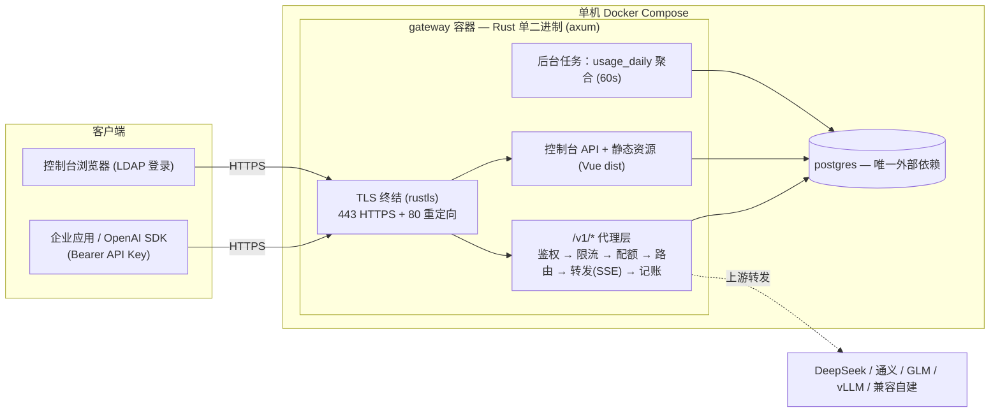

# LLM API 网关 — 定稿设计方案

- 日期：2026-08-08
- 状态：定稿（v1 骨架已按此实施）
- 规模定位：<200 用户、低并发内部部署；架构预留扩容路径

## 1. 目标与范围

| 需求 | 拆解 |
|---|---|
| 认证 | 控制台登录走 LDAP（AD / OpenLDAP 配置驱动兼容）；API 调用走 API Key（用户自助创建/管理） |
| 网关 | 暴露 OpenAI 兼容 `/v1/*`，Key 鉴权后透明转发到上游真实模型服务 |
| 统计 | 按用户 × 模型统计调用次数、输入/输出 Token，支持时间段 + 模型维度查询图表 |
| 管理 | 用户生命周期（重置密码/强制下线/启用禁用）+ 上游配置（代理规则、Base URL、供应商 Key） |
| 管控 | 用量配额（月度 Token/成本上限）+ 三层速率限制（Key/用户/全局），超限返回 429 + Retry-After |

## 2. 架构总览



**三条关键架构决策：**

1. **单二进制模块化单体**：代理热路径、控制台、后台任务同进程；无 Nginx（TLS 由 rustls 终结，静态资源由 tower-http 托管），无 Redis。
2. **记账与热路径解耦但零组件**：请求完成后同步事务直写（日志 + 配额计数同事务原子提交），不引入队列；延迟代价 ~1-2ms，相对 LLM 秒级响应不可见。
3. **内存态仅存在于单实例前提**：限流令牌桶、配额计数缓存、路由表均在进程内，启动/30s 周期从 PG 重载。多实例部署时经 trait 换 Redis 实现（见 §10 权衡）。

## 3. 技术栈

| 层 | 选型 | 说明 |
|---|---|---|
| 网关核心 | Rust (edition 2024) + axum 0.8 + tokio | 流式代理、高并发低内存 |
| TLS | tokio-rustls + hyper-util（官方 low-level-rustls 模式） | ALPN: h2 + http/1.1；ring 提供方（避免 cmake 依赖） |
| HTTP 转发 | reqwest (rustls, stream) | SSE 逐块透传 |
| DB | sqlx + PostgreSQL 16 | 编译期 SQL 校验；`sqlx::migrate!` 内嵌迁移 |
| 加密 | aes-gcm (AES-256-GCM) | 供应商 Key 加密落库，主密钥来自环境变量 |
| 认证 | sha2（API Key 哈希）+ jsonwebtoken（控制台会话，后续） | Key 只存 SHA-256 |
| LDAP | ldap3 crate（后续阶段） | AD / OpenLDAP 配置驱动 |
| 可观测 | tracing + tower-http TraceLayer | 全链路 request_id |
| 前端 | Vue 3 + TS + Element Plus + ECharts（后续阶段） | 控制台 + 仪表盘 |
| 部署 | Docker Compose（gateway + postgres） | 自签/公司 CA 证书挂载 |

## 4. 数据模型

11 张表（迁移 `migrations/0001_init.sql`）：

| 表 | 用途 | 要点 |
|---|---|---|
| `users` | 本地账户 + LDAP 镜像 | `source`(ldap/local)、`status`、`token_version`（强制下线） |
| `api_keys` | 用户 API Key | 只存 `key_prefix`(12位) + `key_hash`(SHA-256)，明文仅创建时展示一次 |
| `providers` | 上游供应商 | `api_type`(openai 兼容扩展点)、`api_key_encrypted`(AES-256-GCM) |
| `model_routes` | 模型→供应商路由 | 通配 pattern + priority + fallback_ids 降级链 |
| `usage_logs` | 用量明细 | `request_id UNIQUE`（幂等）；普通表 + (user_id, created_at) 索引，**v1 不做分区**（规模未到，保留扩展） |
| `user_monthly_usage` | 月度配额计数 | (user_id, month) 主键，记账事务内 UPSERT |
| `usage_daily` | 仪表盘聚合 | (user_id, model, stat_date) 主键，后台任务 60s 聚合 |
| `model_prices` | 计费单价 | 每百万 token 输入/输出价，effective_from 支持调价 |
| `rate_limit_rules` | 限流规则 | scope: global/user/api_key + rpm + burst |
| `user_quotas` | 用户月度配额 | Token/成本上限、结算日、告警阈值 |
| `refresh_tokens` / `audit_logs` / `aggregation_state` | 会话 / 审计 / 聚合水位 | 后两者分别支撑强制下线、管理员追溯、幂等聚合 |

## 5. 核心模块设计

### 5.1 LDAP 对接（配置驱动兼容层，后续阶段）

- 认证模式：服务账号搜索 + 用户凭据 Bind（默认）；direct bind 可切
- 配置项（环境变量）：`LDAP_URL / LDAP_STARTTLS / LDAP_BIND_DN / LDAP_BIND_PASSWORD / LDAP_BASE_DN / LDAP_USER_FILTER(含 {0} 占位) / LDAP_ADMIN_GROUPS`
- AD 默认：`(&(objectClass=person)(sAMAccountName={0}))`；OpenLDAP：`(&(objectClass=inetOrgPerson)(uid={0}))`
- 流程：bind 验证 → 拉取属性/组 → 角色映射（管理员组 → is_admin）→ JIT 同步 users 表 → 检查本地 `status`（本地禁用优先于 LDAP）→ 签发 JWT
- 强制下线：`token_version + 1` + 吊销 refresh_tokens（一个事务）；access token 校验签发版本
- 重置密码：local 用户改写 hash；LDAP 用户引导至目录侧；内置 break-glass local 管理员

### 5.2 OpenAI 兼容层（已实现）

```
POST /v1/chat/completions | /v1/completions | /v1/embeddings | GET /v1/models
 → Bearer Key 提取 → key_prefix 定位 → SHA-256 比对（常数时间）→ 状态/过期校验
 → 三层限流（进程内令牌桶）→ 配额预检查（内存计数缓存）
 → 解析 model → model_routes 匹配（精确 > 通配，priority 排序）→ provider 解密
 → 流式请求自动注入 stream_options.include_usage（若未显式设置）
 → 改写 base_url（约定以 /v1 结尾）+ 注入供应商 Key → reqwest 流式转发
 → SSE 逐块透传，流内解析末帧 usage / [DONE] → 同步记账事务 → 返回
```

- 上游 4xx/5xx **透明透传**（不吞错误），仍记录用量
- 失败降级：非流式按 `fallback_ids` 重试（429/5xx/超时）；流式不重试
- 全链路 `request_id`（uuid v4）+ X-Request-Id 透传

### 5.3 Token 计量与计费（已实现骨架）

三级策略（按模型可配）：

1. 供应商 `usage` 字段（非流式直接读响应；流式经 `include_usage` 末帧解析）——主路径
2. `tiktoken-rs` 本地计数（仅已知编码模型，后续阶段）
3. 启发式估算（无 usage 兜底，后续阶段）

计费：`cost = in/1e6 × p_in + out/1e6 × p_out`，单价查 `model_prices`（无单价记 0）。

记账：请求完成 → 单事务 `INSERT usage_logs + UPSERT user_monthly_usage` → 提交后更新内存计数缓存。日志与配额**原子一致**，无对账需求。

### 5.4 限流与配额（已实现）

- 令牌桶（进程内 `Mutex<HashMap>` + 惰性补充），规则存 `rate_limit_rules`，30s 热加载；LRU 兜底防内存膨胀
- 解析优先级：api_key 规则 > user 规则 > global 规则，命中即 429 + `Retry-After`（秒）+ OpenAI 标准错误体 `{"error":{"code":"rate_limit_exceeded"}}`
- 配额：`user_monthly_usage` 计数缓存预检查，超限 429 `insufficient_quota`；达 `notify_percent` 告警（后续阶段）

### 5.5 管理后台（后续阶段）

| 操作 | 实现 |
|---|---|
| 禁用/启用用户 | `users.status` 翻转 + 吊销会话 |
| 强制下线 | `token_version++` + 吊销 refresh_tokens |
| 重置密码 | local 重写 hash；LDAP 引导至目录侧 |
| 供应商配置 | providers CRUD；Key AES-GCM 加密存储、永不回显 |
| 路由规则 | model_routes CRUD + 热加载（30s 周期重载） |
| 审计 | 管理操作写 audit_logs |

### 5.6 仪表盘（后续阶段）

- 总览卡片：今日调用数 / 输入输出 Token / 预估成本 / 成功率 / P95 延迟
- 图表：时间序列（折线）、模型占比（饼）、用户 Top（柱）；过滤：时间段 + 模型 + 用户
- 数据源：`usage_daily` 秒级查询，明细下钻 `usage_logs`

## 6. 安全设计

- API Key：SHA-256 落库，12 位前缀定位，明文一次性展示
- 供应商 Key：AES-256-GCM（随机 nonce），主密钥 `GATEWAY_MASTER_KEY`（64 hex）来自环境/KMS
- TLS：443 直挂 rustls；80 仅 301 重定向（兼 ACME http-01 入口）；h2 + http/1.1 ALPN
- 响应头/限流/体积上限（50MB）均在应用层中间件
- PostgreSQL 仅 compose 内网暴露；审计日志留痕管理操作

## 7. 可观测性

- tracing 结构化日志（request_id 贯穿）；tower-http TraceLayer 请求日志
- 后续：Prometheus metrics（/metrics）、P95 延迟统计入 usage_daily

## 8. 部署

```yaml
# docker-compose.yml：gateway (443/80) + postgres
```

- 证书：`scripts/gen-cert.sh` 生成自签（P-256）；公网部署接 ACME
- 配置：`.env`（数据库、TLS 路径、主密钥、认证模式、种子上游）
- 首次启动：`providers` 为空时按 `SEED_*` 环境变量种子上游 + 路由

## 9. 实施路线

- **P1（已完成）**：项目骨架、TLS 服务、/v1 代理热路径（鉴权/限流/配额/路由/转发/记账）、迁移、聚合任务、Docker Compose、mock 上游端到端验证
- **P2**：LDAP 登录 + JWT 会话 + 控制台用户/Key 管理 API
- **P3**：控制台前端（Vue 3 + Element Plus + ECharts）、仪表盘
- **P4**：管理后台（用户生命周期操作、供应商/路由配置 UI、审计）、Token 计量二级/三级策略、配额告警

## 10. 已知权衡（诚实清单）

1. **进程内限流/计数**：仅单实例精确；多实例部署需换 Redis 实现（`RateLimiter`/配额缓存已封装，接口不变）
2. **记账同步写入**：PG 不可用时请求失败（内部系统可接受的语义）；无丢失窗口
3. **usage_logs 不分区**：规模增长后按月分区（RANGE），与 request_id UNIQUE 冲突时改全局索引
4. **流式 usage 依赖供应商支持 include_usage**：不支持的供应商走后续启发式策略
