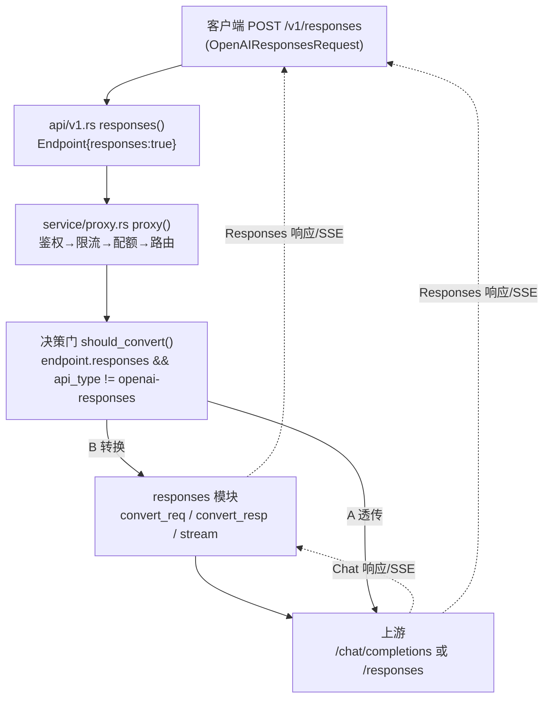

# Responses API 兼容层移植 — 详细设计文档

- 日期：2026-08-10
- 状态：已实现并端到端验证（A 透传 + B 降级转换，非流式 + 流式）
- 参考实现：`third/new-api`（vendored QuantumNous/new-api @ 9c97e78）`relaykit` 的 Responses ↔ Chat 转换器

## 1. 背景与目标

llm_gateway 是字节透传网关，原 API 面只有 `/v1/chat/completions`、`/v1/completions`、`/v1/embeddings`、`/v1/models`。目标上游（DeepSeek / 通义 / GLM / vLLM 等）多数只支持 Chat Completions 协议，而 OpenAI SDK 客户端（`client.responses.create`）已普遍默认走 Responses API。

本移植分两层：

| 层 | 内容 | 适用上游 |
|---|---|---|
| **A 透传** | `/v1/responses` 原生转发 + usage 双形态解析 + SSE 完成检测 | `api_type = openai-responses`（原生支持 Responses 的厂商） |
| **B 降级转换** | Responses 请求 → Chat 请求；Chat 响应 → Responses 响应（非流式 + 流式状态机） | 其余全部上游（默认 `openai` 等 Chat 兼容厂商） |

不做 C（Chat 客户端 → Responses 上游升级转换）：目标上游无原生 Responses 收益，且会扰动现有热路径。

## 2. 总体架构



### 2.1 新模块 `src/service/responses/`

| 文件 | 移植自（Go） | 职责 |
|---|---|---|
| `mod.rs` | — | 模块入口：`convert_request` / `convert_response` / `provider_native_responses` / `should_convert` |
| `dto.rs` | `relaykit/dto/openai_response.go`、`openai_request.go` | 宽松 DTO：Responses 响应/输出/事件/usage 双形态、Chat 请求/流 chunk 解析 |
| `convert_req.rs` | `relaykit/relayconvert/internal/oai_responses/to_oai_chat_req.go` | Responses 请求 → Chat 请求（含有状态字段校验） |
| `convert_resp.rs` | `relaykit/relayconvert/internal/oai_chat/to_oai_responses_resp.go` | Chat 响应 → Responses 响应（非流式） |
| `stream.rs` | `relaykit/relayconvert/internal/oai_chat/to_oai_responses_stream_resp.go` | Chat SSE → Responses SSE：状态机 + 增量解析器 + 流转换管线 |

### 2.2 既有文件改动

| 文件 | 改动 |
|---|---|
| `src/api/v1.rs` | 新增 `POST /v1/responses` 路由；`Endpoint` 增加 `responses: bool` |
| `src/service/proxy.rs` | per-provider outbound 构建（降级转换/透传决策）；非流式响应回转；流式转换管线；`feed_sse` 支持 Responses 终态事件与嵌套 usage |
| `src/store/upstream.rs` | `Provider` 增加 `api_type` 字段（schema 早已有列，补齐读取） |
| `src/store/usage.rs` | `Usage` 双形态（`prompt/completion_tokens` + `input/output_tokens`）+ `input()/output()/total()` 归一化 |
| `src/service/usage.rs` | 记账/成本/缓存全部走归一化访问器 |
| `src/api/mod.rs` | 根 JSON `openai_compat` 列表加 `/v1/responses` |

## 3. 决策门与配置

`providers.api_type`（管理端已支持 CRUD，schema `DEFAULT 'openai'`）：

| api_type | `/v1/responses` 行为 |
|---|---|
| `openai-responses` | **A 透传**：body 原样转发 `/responses`，不注入 stream_options（Responses 流自带 usage），响应/SSE 原样透传 |
| 其他（默认 `openai`） | **B 降级转换**：请求转 Chat 发 `/chat/completions`，响应转回 Responses |

决策在**每个候选上游**上独立判定（`proxy.rs` `build_outbound` 闭包 + 降级链循环内重算），混合 api_type 的降级链可同时工作。管理端改 api_type 后 30s 热加载生效（`GATEWAY_RELOAD_INTERVAL`）。

## 4. 转换规则

### 4.1 请求：Responses → Chat（`convert_req.rs`）

| Responses 字段 | Chat 字段 | 语义要点 |
|---|---|---|
| `model` | `model` | 必填，缺失 400 |
| `instructions` | system 消息 | 非字符串原样序列化为文本；空串跳过 |
| `input` 字符串 | user 消息 | |
| `input` 数组 item `message` | 同 role 消息 | role 缺失默认 user；content 部件改写 |
| content part `input_text/output_text/text` | `{type:"text"}` | 全部文本部件时收敛为纯字符串 |
| `input_image` | `{type:"image_url"}` | `image_url` 归一化为字符串/对象 |
| `input_file` / `input_audio` / `input_video` | `file` / `input_audio` / `video_url` | 载荷取命名字段，缺省取去 type 后的全量 |
| item `function_call` | 并入最后一条 assistant 消息 `tool_calls` | 无 assistant 消息则新建（`content: null`）；`call_id` 缺省回退 `id`；`name` 必填否则 400 |
| item `custom_tool_call` | 同上，`type: "custom_tool_call"` + `custom` 携带原始 item | |
| item `function_call_output` | tool 消息 | `tool_call_id` 缺失不报错（与 Go 一致） |
| `tools` | `{type:"function", function:{name,description,parameters}}` | 非 function 工具原样携带 `custom` |
| `tool_choice` 对象 | `{type:"function", function:{name}}` | 字符串原样 |
| `text.format` | `response_format` | `json_schema` 需嵌套完整 format 对象 |
| `max_output_tokens` | `max_completion_tokens` | 0 省略 |
| `reasoning.effort` | `reasoning_effort` | |
| `stream` / `temperature` / `top_p` / `top_logprobs` / `parallel_tool_calls` / `user` / `store` / `metadata` / `service_tier` / `safety_identifier` / `prompt_cache_*` / `enable_thinking` / `thinking_budget` | 同名 | 存在且非 null 才携带 |
| `conversation` / `previous_response_id` / `prompt` / `context_management` | **拒绝 400** | 有状态字段无法映射到无状态 Chat API，错误信息列明字段名 |

### 4.2 响应：Chat → Responses（非流式，`convert_resp.rs`）

| Chat 字段 | Responses 字段 | 语义要点 |
|---|---|---|
| `finish_reason: length` | `status: "incomplete"` + `incomplete_details.reason: "max_output_tokens"` | |
| `finish_reason: content_filter` | `incomplete` + `content_filter` | |
| 其他 finish_reason | `status: "completed"` | 注意 `tool_calls` 也映射 completed（Go 语义） |
| `message.content` | message output（`output_text`） | 字符串/文本部件数组均支持；输出 item id `{resp_id}_msg_0`、role assistant、`annotations: []` |
| `message.reasoning_content` | reasoning output（`summary_text`） | id `{resp_id}_reasoning_0` |
| `message.tool_calls[]` | function_call outputs | `call_id` 缺省回退 `{resp_id}_call_{i}`；arguments 以 JSON 字符串输出 |
| `usage` | 双语义 usage | 见 4.4 |
| — | `id` | 网关生成 `resp_<uuid>` |
| `created` | `created_at` | 缺失回退当前时间 |

输出响应保留完整字段面（`instructions: null`、`max_output_tokens: 0`、`parallel_tool_calls: false` 等），与 new-api wire 一致，SDK 严格解析安全。

### 4.3 流式：Chat SSE → Responses SSE（`stream.rs`）

增量状态机 `ChatToResponsesStreamState`，逐 chunk 消费：

```
Chat chunk ──► [response.created]（首帧，status: in_progress）
              ├─ reasoning_content ► [output_item.added(reasoning)] [reasoning_summary_text.delta]
              ├─ content           ► [output_item.added(message)] [output_text.delta]
              ├─ tool_calls        ► [output_item.added(function_call, arguments:"")]
              │                       [function_call_arguments.delta]
              └─ finish_reason     ► [output_text.done] [output_item.done]
                                     [reasoning_summary_text.done(+part)] [output_item.done]
                                     [function_call_arguments.done] [output_item.done]（工具按 index 升序）
[DONE]/流尾  ──► [response.completed / response.incomplete]（终态，含完整 output + usage）
```

关键语义（与 Go 逐条对齐）：

- **工具关联**：按 Chat `delta.tool_calls[].index` 关联（`tools_by_index`），输出序号按出现顺序分配；`finish_reason` 到达时按 index 升序补发 done。
- **幂等**：`finalize()` 只执行一次；文本/推理/工具各自的 done 标志防止 finish_reason 重复到达时重复补发。
- **终态**：`length`/`content_filter` → `response.incomplete`；输出 item 状态同步 `incomplete`。
- **usage**：从 chunk 累积，终态 `response.completed` 事件携带（双语义 + details 搬运）；上游无 usage 时输出零值 usage 对象（防 SDK 解析失败）。
- **SSE wire**：`event: {type}\ndata: {json}\n\n`（与 new-api `ResponseChunkData` 输出一致，含空行分隔）。
- **增量解析器** `ChatSseParser`：跨块缓冲、`\n\n`/`\r\n\r\n` 切分、忽略 `event:`/注释帧、`[DONE]` 终止、1MB 防爆（与 `feed_sse` 同语义）。
- **流中断兜底**：上游未以 `[DONE]` 结束（断连）时，尾帧补发终态事件并记账（usage 未知）。

### 4.4 usage 双形态（`store/usage.rs` + `dto.rs`）

```jsonc
// Chat 上游（B 路径解析 + 记账）
{"prompt_tokens": 12, "completion_tokens": 7, "total_tokens": 19, ...}
// Responses 上游（A 路径解析 + 记账）
{"input_tokens": 12, "output_tokens": 7, "total_tokens": 19, ...}
```

- `Usage` 结构同时解析两套字段，`input()/output()/total()` 归一化，记账/成本计算全部走访问器（`record_usage`、`service::usage::record`、`compute_cost` 已更新）。
- 输出给客户端的 usage 双语义并写：`input_tokens`/`output_tokens` + `prompt_tokens`/`completion_tokens` + `total_tokens` + details 搬运（`prompt_tokens_details` 恒输出零值对象；`input_tokens_details` 任一分量非零才输出）。

### 4.5 SSE 完成检测（`feed_sse`）

Chat 流用 `[DONE]` 哨兵；Responses 流**没有哨兵**，以终态事件判定：

- `data.type ∈ {response.completed, response.incomplete, response.failed, response.done}` → 结束
- usage 捕获优先顶层 `usage`，**终态事件内嵌套 `response.usage` 也捕获**（真实 OpenAI 协议 usage 嵌在 response 对象里——这是冒烟测试抓出的真实 bug，`feed_sse_responses_stream` 回归测试锁定）

## 5. 代理管线集成（`proxy.rs`）

- `Endpoint` 增加 `responses: bool`；`/v1/responses` 路由复用完整管线（鉴权→限流→配额→路由→转发→记账），`usage_logs.endpoint = "/v1/responses"`。
- **流式**：仅主上游（不重试，防重复生成）；转换路径走 `wrap_chat_stream_to_responses`（转换器内部记账）；透传路径走原 `wrap_stream`；非 2xx 透传错误体、记 0 token。
- **非流式**：按降级链重试（429/5xx/超时）；每次尝试独立决策（api_type 混合链可工作）；成功响应体转换（`choices` 存在才转换，错误体/异常体透传原文）；4xx 透传不重试。
- 转换路径流式请求自动注入 `stream_options.include_usage`（Chat 语义，确保精确记账）；透传路径不注入（Responses 协议无此字段）。
- `upstream_model` 改写对两条路径都生效（在转换后/透传 body 上改 `model`）。

## 6. 验证

### 6.1 单元测试（25 通过，`cargo test`）

| 测试 | 覆盖 |
|---|---|
| `convert_req` 8 项 | 富请求转换（含多模态/工具调用，对照 Go 黄金夹具语义）、input 字符串、有状态字段拒绝、model 必填、tool_choice/text.format/reasoning 映射 |
| `convert_resp` 5 项 | 完整响应转换（输出顺序/usage 双语义/字段面）、length→incomplete、call_id 回退、空 choices、tool_calls 不覆盖 completed |
| `stream` 6 项 | 事件序列、reasoning 先行、多工具乱序关联、length→incomplete 终态、SSE 解析器、SSE wire 格式（与 new-api 逐字节一致） |
| `proxy.feed_sse` 4 项 | Chat 流 `[DONE]`、Responses 流嵌套 usage + 终态判定、response.done 无 usage、跨块缓冲 + 顶层 usage |

### 6.2 端到端冒烟（mock 上游 + docker-compose postgres，`scripts/mock_upstream.py` 已扩展原生 `/v1/responses`）

| 场景 | 结果 |
|---|---|
| B 非流式：`/v1/responses` → mock `/chat/completions` | 200，`resp_<uuid>`、message output、usage 12/7 双语义 ✓ |
| B 流式：事件序列 created→added→delta×3→done→completed(含 usage) | 与 new-api 黄金一致 ✓ |
| B 记账 | `usage_logs` 12/7，endpoint=/v1/responses ✓ |
| B 有状态字段（previous_response_id + prompt） | 400 `invalid_request_error`，消息列明字段 ✓ |
| A 非流式透传（api_type=openai-responses） | mock 原生 Responses JSON 原样透传，usage 12/7 ✓ |
| A 流式透传 | 事件原样透传，usage 从 `response.completed` 嵌套 `response.usage` 捕获，记账 12/7 ✓ |

## 7. 已知限制与后续

1. **C 升级路径未做**：Chat 客户端 → Responses 上游（`to_oai_responses_req.go` 等）按需再移植；决策门已预留（`should_convert` 对称扩展）。
2. **custom_tool_call 最佳努力**：Chat 上游基本不支持，custom 字段原样携带，文档化偏差（Go 会输出空 function 对象，Rust 收敛省略）。
3. **流式 content 数组忽略**：极少数上游流式 content 发 part 数组，转换忽略（Go 同行为）。
4. **非流式响应转换失败**：透传原文（错误体是 OpenAI 统一形状，Responses 客户端可解析）。
5. **`api_type` 取值文档**：管理端无枚举校验，取值自由字符串；仅 `openai-responses` 触发透传，其余一律转换（保守默认）。

## 9. 代码审查（2026-08-10 二次审查）修复与遗留

| 问题 | 严重度 | 处置 |
|---|---|---|
| 流式 converted 分支缺 SSE content-type 防护：上游 200 + JSON 错误体被 SSE 解析器吞掉，客户端只收到空 `response.completed` | 中 | 已修：`content_type.contains("text/event-stream")` 才走转换管线，否则原 wrap_stream 透传（冒烟验证错误体原样透传） |
| 非流式 converted 分支对 4xx 错误体若含 `choices` 也会转换 | 低 | 已修：加 `status.is_success()` 守卫 |
| `reasoning` 字段缺失：Go `GetReasoningContent` 同时支持 `reasoning_content` 与 `reasoning`，Rust 只解析前者 | 低 | 已修：`ChatStreamDelta.reasoning` + 状态机 `or` 回退 + 回归测试 |
| 客户端断连时流式记账丢失（`Body::from_stream` drop 时 tail 兜底 future 不执行） | 中（预存架构） | 遗留：chat 流式（wrap_stream）同有，非本次引入；需 Body 生命周期重构才能根治 |
| `process_chunk` 中 `id`/`created` 覆盖为死代码（初始值恒非空/非零） | 无 | 遗留（与 Go 行为一致，响应 id/时间均以网关为准） |
| `usage_from_chat` 中 `input_tokens: if input != 0 { input } else { 0 }` 恒等冗余 | 无 | 遗留（纯冗余，无功能影响） |
| 工具首个 chunk 无 id 时 added 事件 id 与后续 delta item_id 不一致 | 低（与 Go 一致） | 遗留：上游违反协议时出现，参考实现同样行为 |
| output item `id` = `call_id`（非独立 item id） | 低（与 Go 一致，已核对 `to_oai_responses_resp.go` `ID: callID`） | 遗留：SDK 用 call_id 匹配工具调用，不受影响 |

## 10. 回归步骤

```bash
# 单元测试
cargo test

# 端到端（需要 docker-compose postgres）
docker-compose up -d postgres
python3 scripts/mock_upstream.py &          # 9001
./target/debug/llm_gateway &                # 种子 provider + admin
# 注入测试 key（sha256 全键哈希，12 位前缀定位，见 service/auth.rs）
# B：默认 api_type=openai
curl -sk https://127.0.0.1:8443/v1/responses -H "Authorization: Bearer $KEY" \
  -H 'Content-Type: application/json' -d '{"model":"mock-1","input":"hi"}'
# A：UPDATE providers SET api_type='openai-responses' WHERE name='mock';（30s 内生效）
curl -skN https://127.0.0.1:8443/v1/responses -H "Authorization: Bearer $KEY" \
  -H 'Content-Type: application/json' -d '{"model":"mock-1","input":"hi","stream":true}'
# 记账核对
docker-compose exec -T postgres psql -U gateway -d llm_gateway \
  -c "SELECT endpoint, streamed, input_tokens, output_tokens, status FROM usage_logs ORDER BY id DESC LIMIT 5;"
```
